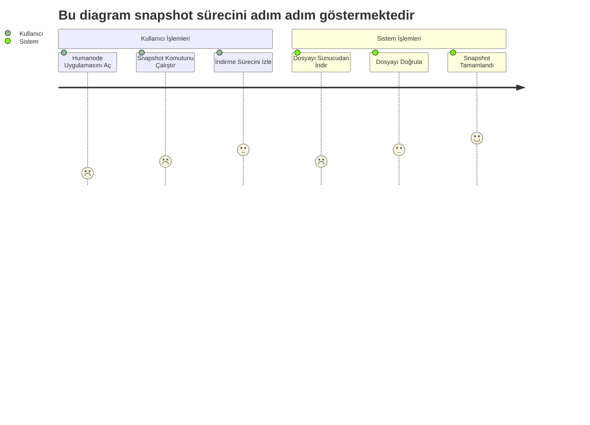

Merhaba arkadaşlar, her Cuma günü yedek ```(snapshot)``` dosyasını güncelleyeceğim. Bu yedeği, yeni düğüm ```(node)``` kurulumu yaparken, düğüm taşıması yaparken ya da sorunlu, çalışmayan bir sunucudan düğümünüzü acil bir şekilde taşımak isterseniz kullanabilirsiniz. 

Kurulumu çok basit. İster yeni kurulum yapın, ister taşıma yapın farketmez ilk önce düğümünüzü kurun normal bir şekilde. Humanode uygulamasında ```(launcher)``` bulunan ```log``` kısmına gidin. Bir kaç blok geçtikten sonra uygulamada ki ```stop``` butonuna basarak düğümünüzü durdurun. Humanode'nun kurulu olduğu sunucuya giriş yapın terminal üzerinden. Yedek kurulumuna aşağıda ki komutlarla devam edin...



------

# Yedek Kurulum Adımları

1- Eski düğümün dosyalarını silin.
```4D
rm -rf /root/.humanode/workspaces/default/substrate-data/chains/humanode_mainnet/db/full
```

2- Aşağıda ki komut ile kurulumu başlatın. Bu yedek sizi ```#10953728. bloktan``` başlatacaktır. 

> [!CAUTION] 
> :loudspeaker: ```03.01.2025``` tarihinde güncellenmiştir.
> 
> :warning: Yedek dosyasının büyüklüğü ve sunucunuzun internet hızına bağlı olarak bekleme süreniz değişkenlik gösterebilir. Ancak unutmayın ki yedek kurulumu tamamlanmadan terminali kapatmamalısınız!

```Sieve
curl -L http://89.116.25.136/03012025/snapshot.tar.gz | tar -xz -C /root/.humanode/workspaces/default/substrate-data/chains/humanode_mainnet/db/
```

3- Kurulum tamamlandıktan sonra tekrardan Humanode uygulamasına giriş yapın ve ```Start The Node``` butonuna basın. 

> [!CAUTION] 
> :warning: Eğer uygulama çalışmazsa o zaman ```Node Validator Key``` yeşil olana kadar uygulamayı bir kaç kere kapatıp geri açın. Genelde uygulamayı 2-3 kere katıp açtıktan sonra düzeliyor.


---


## Sıkça Sorulan Sorular

1. Snapshot Kurulumu Sonrası Node Çalışmıyor.
Neden: Eksik dosyalar veya uyumsuz yapılandırma.
Çözüm: Eksik dosyalar varsa snapshot işlemini tekrar edin

**Soru:** Snapshot indirme sırasında hata alıyorum, ne yapmalıyım?

**Cevap:** İnternet bağlantınızı kontrol edin ve komutları doğru girdiğinizden emin olun. Sorun devam ederse [benimle](https://t.me/FrtKmrc) ile iletişime geçin.
